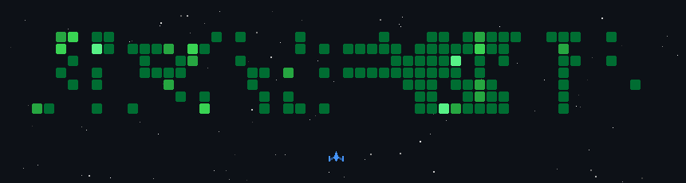

<!--
  ╔══════════════════════════════════════════════════════════════╗
  ║                Raphael Omorose · @OfficialEseosa             ║
  ║       Computer Science · Georgia State University            ║
  ║            Full-Stack · Mobile · Systems Thinker             ║
  ╚══════════════════════════════════════════════════════════════╝
-->

<div align="center">


<a href="https://github.com/OfficialEseosa">
  
</a>

<br/>

<a href="https://github.com/OfficialEseosa"></a>
<a href="https://linkedin.com/in/raphaelomorose"></a>
<a href="mailto:raphaelomorose@gmail.com"></a>


</div>

---

## 🎮 My GitHub, as a Space Shooter

> Every enemy ship below represents a day of my contributions. The game regenerates itself daily via [GitHub Actions](.github/workflows/update-game.yml) — powered by [`czl9707/gh-space-shooter`](https://github.com/czl9707/gh-space-shooter).

<div align="center">
  
</div>

---

## 🐍 Watch a snake eat my contributions

<div align="center">
  
</div>

---

## 🧠 About Me


```yaml
name:       Raphael Omorose
role:       Computer Science Student & Full-Stack Dev
school:     Georgia State University 🐾
focuses:    [ backend systems, mobile apps, real-time UX ]
currently:  building DateBlue (Flutter + Firebase)
favorite:   shipping > shipping plans
mantra:     "Built to survive contact with real users."
asking:     [ why does this exist?, who does it help?, can it be simpler? ]
```

I'm a CS major at **Georgia State** focused on building practical, end-to-end systems.
I live at the intersection of complex backend logic and seamless user experiences —
and I believe great products are obvious in hindsight, invisible in use, and impossible without empathy.

---

## 🚀 What I'm Building

<table>
<tr>
<td width="50%" valign="top">

### 🏆 PantherWatch
**Real-time GSU course availability tracker.**
No more refresh-and-pray during registration.

- ⚡ Reactive API with **Java 21 + Spring WebFlux**
- 🔎 Scheduled `CourseWatcher` scrapes live seat data
- 📱 Native **Kotlin + Jetpack Compose** Android client
- 📊 **React** admin dashboard (announcements, stats, logs)

> Built to scale beyond "it works on my machine."

</td>
<td width="50%" valign="top">

### 🔭 DateBlue *(in progress)*
**Hyper-local social + dating platform for GSU.**

- 🔐 `@student.gsu.edu` verification via **Firebase Cloud Functions**
- 🎙️ Custom **Voice Prompt** engine (`audio_waveforms`)
- 🎬 Video engine powered by `media_kit`
- ⚡ Push alerts (FCM) + offline cache (Hive DB)
- 📱 One **Flutter/Dart** codebase → iOS + Android + Web

</td>
</tr>
</table>

---

## 🛠️ Tech Toolbox

<div align="center">

**Languages**
<br/>


**Frameworks & Mobile**
<br/>


**Cloud, Data & Tools**
<br/>


</div>

---

## 📊 The Numbers

<div align="center">


<br/>


</div>

### 🏆 Trophy Cabinet

<div align="center">
  <a href="https://github.com/ryo-ma/github-profile-trophy">
    
  </a>
</div>

### 📈 Contribution Graph

<div align="center">
  
</div>

---

## 🎵 What I'm Listening To

<!--
  SPOTIFY SETUP (5-minute one-time config)
  ────────────────────────────────────────
  The Spotify widgets below rely on a public deploy of `novatorem` (currently
  playing) and `spotify-recently-played-readme` (recent tracks).

  To make them show YOUR music instead of placeholder data:

  1. Go to https://developer.spotify.com/dashboard → create an app.
     Note your Client ID and Client Secret.
  2. Fork https://github.com/novatorem/novatorem
  3. Follow the README → deploy to Vercel, set env vars
     (SPOTIFY_CLIENT_ID, SPOTIFY_SECRET, SPOTIFY_REFRESH_TOKEN).
  4. Replace `YOUR_VERCEL_URL` below with your deployed URL.
  5. (Optional) Do the same for JeffreyCA/spotify-recently-played-readme
     for the recent-tracks chart.
-->

<div align="center">

**🎧 Currently Playing**
<br/>
<a href="https://open.spotify.com/user/raphaelomorose">
  
</a>

<br/><br/>

**🔥 Recently Played**
<br/>
<a href="https://open.spotify.com/user/raphaelomorose">
  
</a>

</div>

> 🎼 *Music fuels code.* When I'm shipping, expect Afrobeats, hip-hop, and the occasional lo-fi detour.

---

## 💭 Random Dev Quote

<div align="center">
  
</div>

---

## ⚡ Fun Facts

- 🐾 I go to **Georgia State** — Panther for life.
- 🏗️ I'd rather ship a scrappy v1 than plan a perfect v3.
- 🎮 I built this profile readme like a game map — GIFs, snakes, shooters. Welcome to the arcade.
- ☕ Coffee powered, deadline motivated.
- 🧭 I'm always looking for collabs on ideas that matter to real people.

---

## 📫 Let's Connect

<div align="center">

<a href="https://linkedin.com/in/raphaelomorose"></a>
<a href="mailto:raphaelomorose@gmail.com"></a>
<a href="https://github.com/OfficialEseosa"></a>

<br/>

*If you're building something that survives contact with real users — I'm listening.*

</div>


