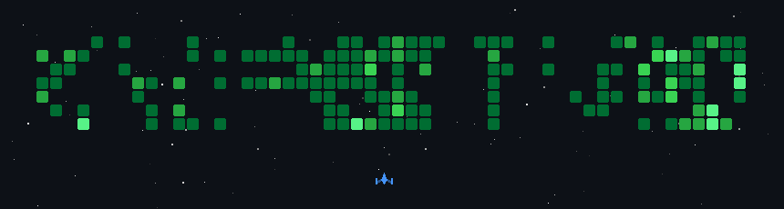

### What I'm building

<table>
<tr>
<td width="33%" valign="top">

**[PantherWatch](https://github.com/OfficialEseosa/panther-watch)** 
Real-time GSU course availability tracker. No more refresh-and-pray during registration. 
Java 21 · Spring WebFlux · Kotlin · Jetpack Compose · React

</td>
<td width="33%" valign="top">

**[CampusMaps](https://github.com/OfficialEseosa/CampusMaps)** 
AR campus map app that helps students find their way around. 
Kotlin · Android

</td>
<td width="33%" valign="top">

**[Last Night on Maple Street](https://github.com/OfficialEseosa/last-night-on-maple-street)** 
A cooperative two-player browser adventure set on the last summer night of 2002. 
Browser game · Co-op

</td>
</tr>
</table>

